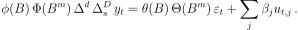
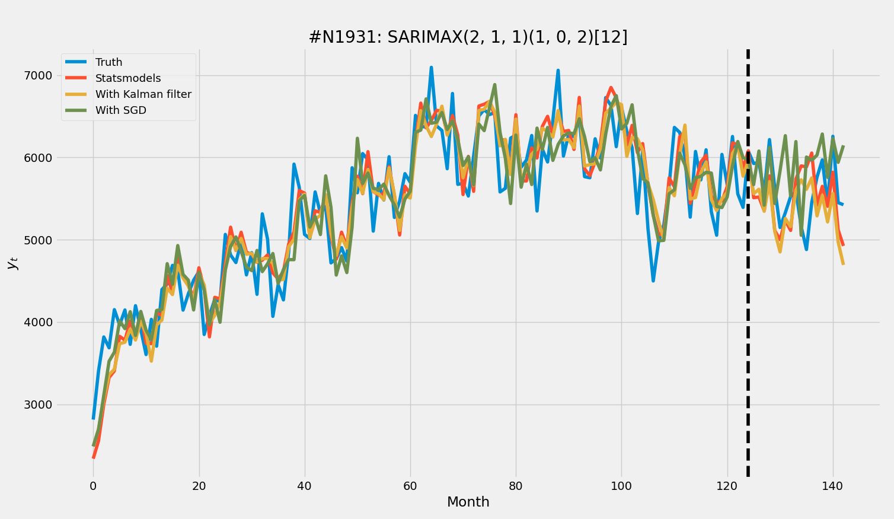

# sarimax-models
Estimate S-ARIMA-X models with Stochastic Gradient Descent or Kalman Filter

### What is S-ARIMA-X?

It stands for *Seasonal AutoRegressive Integrated Moving Average with eXogenous variables*...

The formulation is:

&emsp;&emsp;&emsp;&emsp;&emsp;&emsp;&emsp;&emsp;&emsp;&emsp;


### Estimation

We need to estimate those greek letters, i.e., the S-AR, S-MA, X parameters of the model, which is said to be of order *(p, d, q)(P, D, Q)[m]*.

First way is to use Stochastic Gradient Descent (SGD). Logic is this: we fit a large AR(p) model first, get the residuals of it and use it as the unobserved noise in the formulation. Then we form the design matrix and employ SGD to find all the parameters.

Second way is via MLE: we put the S-ARIMA-X into a (Hamiltonian) state space formulation, run a Kalman filter for likelihood and a numerical optimizer solves for parameters (e.g, L-BFGS). [statsmodels](https://www.statsmodels.org/dev/generated/statsmodels.tsa.statespace.sarimax.SARIMAX.html) does something like this, too; but they also offer Harvey's representation (that's the default and used in below example).

### Example result
Here is a sample monthly data from [M3 Competiton dataset](https://forecasters.org/resources/time-series-data/m3-competition/). Black vertical line is train-test split point. All models have the order *(2, 1, 1)(1, 0, 2)[12]*:




### Usage
For SGD:

```python
from sgd_sarimax import SARIMAX_SGD
model = SARIMAX_SGD(endog, exog, order=(2, 1, 3), seas_order=(1, 1, 0, 4))
model.fit(max_iter=5_000, eta0=0.1)

preds_in_sample = model.predict_in_sample()
foreacasts = model.forecast(steps=10)
```

For KF:

```python
from kalman_sarimax import SARIMAX_KF
model = SARIMAX_KF(endog, exog, order=(2, 1, 3), seas_order=(1, 1, 0, 4))
model.fit()

preds_in_sample = model.predict_in_sample()
foreacasts = model.forecast(steps=10)
```
